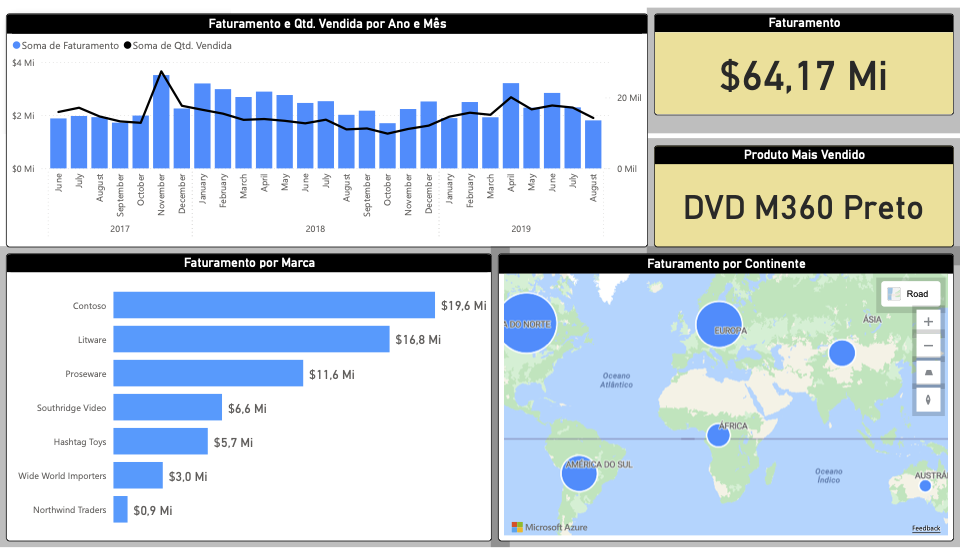

## About me

Physicist with a background in complex systems and eco-evolutionary modeling, now focused on data science and statistical analysis.

## Education
- Ph.D., Physics | University of Campinas - Campinas, Brazil (08/2011 – 01/2018)
- Visiting Ph.D. Student | Université Paris-Diderot  - Paris, France (03/2015 – 02/2016)                           		
- B.S., Physics | University of Campinas - Campinas, Brazil (03/2007 – 07/2011)

## Experience

- Postdoctoral Fellow - International Centre for Theoretical Physics (ICTP) - Trieste, Italy (08/2023 - 12/2025) 
<!-- _Developed mathematical models to study the evolution of social and economical aspects in structured populations employing analytical and simulation-based approaches._ -->

- Postdoctoral Fellow - University of Campinas Campinas, Brazil (02/2018 – 07/2023)
<!-- _Conducted simulations and data-analysis for eco-evolutionary models, employing Fortran and Python; applied statistical methods and visualization tools to identify biodiversity patterns._-->

- Visiting Postdoctoral Researcher - University of Pennsylvania Philadelphia, United States (03/2020 – 02/ 2021)
<!-- _Developed a Mathematica-based algorithm for statistical inference in a stochastic phoneme evolution model, analyzing large datasets._-->

## Projects

<table>
  <tr>
    <td align="center" width="120">
      <a href="https://github.com/deborapr/projeto-1">
         
      </a>
    </td>
    <td>
      <strong><a href="https://github.com/deborapr/projeto-1">Nome do Projeto 1</a></strong> 
      Resumo direto em uma ou duas linhas: o que o projeto faz e qual problema resolve. 
      Tech: React · Node.js · PostgreSQL
    </td>
  </tr>

  <tr>
    <td align="center" width="120">
      <a href="https://github.com/deborapr/PowerBI">
         
      </a>
    </td>
    <td>
      <strong><a href="[https://github.com/deborapr/projeto-1](https://github.com/deborapr/PowerBI)">Power BI Projects</a></strong> 
      Dashboards developed as part of the Power BI Basic Course (_Hashtag Treinamentos_), focusing on data modeling, Power Query, DAX measures, and interactive dashboard design. 
      Tech: Power BI · Power Query · DAX 
    </td>
  </tr>
  
 <!-- <tr>
    <td align="center" width="120">
      <a href="https://github.com/seu-usuario/projeto-2">
         
      </a>
    </td>
    <td>
      <strong><a href="https://github.com/seu-usuario/projeto-2">Nome do Projeto 2</a></strong> 
      Resumo direto em uma ou duas linhas: o que o projeto faz e qual problema resolve. 
      Tech: Python · FastAPI · Docker
    </td>
  </tr>
  <tr>
    <td align="center" width="120">
      <a href="https://github.com/seu-usuario/projeto-3">
         
      </a>
    </td>
    <td>
      <strong><a href="https://github.com/seu-usuario/projeto-3">Nome do Projeto 3</a></strong> 
      Resumo direto em uma ou duas linhas: o que o projeto faz e qual problema resolve. 
      Tech: TypeScript · Next.js
    </td>
  </tr> -->
</table>

## Skills

Python · SQL · Fortran · Git · Machine Learning · Statistics

<!-- ## Talks & Lectures -->

<!-- ## Publications -->
